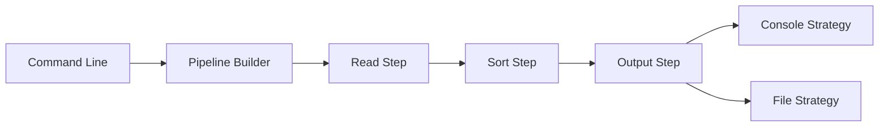

# Name Sorter

A production-ready .NET application demonstrating enterprise architecture patterns for sorting names from a file. This solution was developed as part of a coding assessment where candidates were asked to demonstrate coding and design skills while fulfilling a very simple task.

## Overview

Name Sorter is a command-line application that reads a list of names from a file, sorts them according to specific rules, and outputs the sorted results both to the console and to a file.

## Design Philosophy

While the core requirement (sorting names from a file) could be implemented in ~50 lines, this solution is architected as **production-ready enterprise software**. The design choices reflect real-world software engineering practices:

### Why This Architecture?

**Testability First**
- Every component is independently testable through interface abstraction
- Comprehensive unit tests, integration tests, and benchmark tests
- Dependency injection enables easy mocking and isolation

**Built for Change**
- Pipeline architecture allows adding/removing steps without modifying core logic
- Strategy pattern enables multiple output formats (console, file, future: API, database)
- Open/Closed Principle: extend behavior without changing existing code

**Enterprise Patterns**
- Result<T> pattern for explicit error handling without exceptions
- Command-line configuration using System.CommandLine
- Proper separation of concerns (Infrastructure, Pipeline, Configuration, Domain)

**Production Quality**
- Comprehensive error handling and validation
- XML documentation on all public APIs
- Follows SOLID principles throughout
- Modern C# 12 features (primary constructors, collection expressions)

This approach demonstrates how to build **maintainable, extensible, team-friendly code**.

## Features

- Reads names from an input file
- Supports names with 1 to 3 given names and a single last name
- Sorts names by last name, then by given names
- Outputs sorted names to both console and file
- Comprehensive validation and error reporting with detailed feedback
- Fully testable architecture with interface-based design
- Flexible pipeline architecture for easy extension
- Command-line interface with customizable file input and output location
- Production-ready error handling using Result pattern
- Performance benchmarking suite included

## Requirements

- .NET 9.0
- Windows/Linux/macOS compatible

## Installation

1. Clone the repository
2. Build the solution:
```bash
dotnet build
```
3. Run the application:
```bash
dotnet run --project NameSorter -- ./unsorted-names-list.txt
```
Or build and run the published executable:
```bash
dotnet publish -c Release
cd NameSorter/bin/Release/net9.0/publish
./name-sorter ./unsorted-names-list.txt
```

## Usage

Basic usage:
```bash
name-sorter ./unsorted-names-list.txt
```

With custom output file:
```bash
name-sorter ./unsorted-names-list.txt --output ./custom-output.txt
```

### Input File Format

- One name per line
- Each name can have between 1 and 3 given names followed by a single last name
- Names must be separated by single spaces

Example input file:

```txt
John Coltrane 
Peter Brotzmann
Tim Jones 
Wolfgang Amadeus Mozart
```

### Output

The application will:
1. Read names from the input file
2. Sort them according to the rules
3. Display the sorted names on the console
4. Write the sorted names to 'sorted-names-list.txt' (or to another output file specified in the command-line)

## Architecture

### Overview

The application implements a **flexible pipeline architecture** with **SOLID principles** at its core. This design enables the system to absorb changing requirements without modification to existing code.



### Core Components

- **Pipeline Pattern**: Modular processing steps for extensibility
- **Dependency Injection**: Using Microsoft.Extensions.DependencyInjection
- **Command Line Interface**: Using System.CommandLine
- **Strategy Pattern**: For flexible output handling

### Pipeline Steps

1. **Read**: Extracts names from input file
2. **Sort**: Orders names by last name and given names
3. **Output**: Writes results to console and file

### Design Patterns

The application demonstrates several enterprise design patterns:

**Pipeline Pattern** (`IPipelineStep`, `PipelineProcessor`)
- Modular, ordered data processing
- Each step is independently testable
- Steps are automatically ordered via `PipelineStepOrderAttribute`

**Strategy Pattern** (`IOutputStrategy`)
- Multiple output formats without changing core logic
- Currently implements: Console and File strategies
- Easy to add: Database, API, Email, etc.

**Builder Pattern** (`PipelineBuilder`)
- Constructs and validates pipeline from DI-registered steps
- Ensures no duplicate step orders
- Validates pipeline integrity before execution

**Result Pattern** (`Result<T>`)
- Explicit error handling without exceptions
- Used in `NameParser` for expected validation failures
- Enables error aggregation and detailed feedback

### Extensibility Examples

The architecture makes adding features straightforward without modifying existing code:

**Adding CSV Support:**
```csharp
[PipelineStepOrder(PipelineStepOrders.Read)]
public class ReadCsvExtractStep : IPipelineExtractStep 
{
    public IEnumerable<Person> Process() { /* CSV parsing logic */ }
}
// Register in Program.cs - no other changes needed
```

**Adding Database Output:**
```csharp
public class DatabaseOutputStrategy : IOutputStrategy 
{
    public void Output(IEnumerable<Person> people) { /* Save to DB */ }
}
// Register in Program.cs - existing code untouched
```

### Key Interfaces

| Interface | Purpose | Implementations
|-----------|---------|-----------------|
| IPipelineStep | Base marker for pipeline components | All steps implement this
| IPipelineExtractStep | Extract data from external source | ReadNamesExtractStep |
| IPipelineTransformStep | Transform data in pipeline | SortNamesTransformStep, OutputNamesTransformStep | 
| IOutputStrategy | Define output behavior | ConsoleOutputStrategy, FileOutputStrategy |
| INameParser | Parse string to Person | NameParser |
| INameSorter | Sort Person collections | NameSorter |
| IFileSystem | Abstract file I/O for testability | FileSystem |
| IConsoleWriter | Abstract console I/O for testability | ConsoleWriter |
| ICommandLineConfig | Command-line configuration | CommandLineConfig |

## Testing

The solution includes **comprehensive test coverage** across multiple testing strategies:

### Test Projects

| Project | Type | Coverage                             |
|---------|------|--------------------------------------|
| **NameSorter.Tests** | Unit Tests | Test classes covering all components |
| **NameSorter.IntegrationTests** | Integration Tests | End-to-end pipeline validation       |
| **NameSorter.Benchmarks** | Performance Tests | BenchmarkDotNet profiling            |

### Test Strategy

**Unit Tests** - Isolated component testing using NSubstitute for mocking:
- `PersonTests`: Domain model validation
- `NameParserTests`: Parsing logic with edge cases
- `NameSorterTests`: Sorting algorithm verification
- `PipelineBuilderTests`: Pipeline construction and ordering
- `FileSystemTests`: Path validation
- `ConsoleOutputStrategyTests`, `FileOutputStrategyTests`: Output behavior
- Full coverage of pipeline steps

**Integration Tests** - Full pipeline execution:
- Valid input processing
- Empty file handling
- Invalid name detection
- File not found scenarios
- Uses mocked file system and console for deterministic testing

**Benchmark Tests** - Performance profiling:
- Name parsing performance across different name formats
- Sorting performance with various data distributions
- Enables data-driven optimization decisions

### Running Tests

```bash
# Run all tests
dotnet test

# Run benchmarks
dotnet run --project NameSorter.Benchmarks -c Release
```

### Test Quality Metrics
- All tests follow **Arrange-Act-Assert** pattern
- Descriptive test names (no "Test1", "Test2")
- Both positive and negative test cases
- Edge cases explicitly tested (whitespace, boundaries, nulls)

## Error Handling

The application implements **defense in depth** with multiple layers of error handling:

### Validation Layers

1. **Command-Line Validation** (`CommandLineConfig`)
   - File path argument validation
   - System.CommandLine automatic help generation

2. **File System Validation** (`FileSystem`)
   - Path safety checks (invalid characters, malformed paths)
   - File existence verification
   - Throws meaningful exceptions with context

3. **Parse Validation** (`NameParser`)
   - Uses **Result<T> pattern** for expected failures
   - Returns explicit error messages (not exceptions)
   - Example: `"Name must contain at least one given name and one last name (SingleName)"`

4. **Domain Validation** (`Person`)
   - Constructor validation (1-3 given names, required last name)
   - Immutable design prevents invalid state

5. **Top-Level Handler** (`Program.cs`)
   - Catches unhandled exceptions
   - Provides user-friendly error messages
   
### Future Enhancements

As noted in the architecture, the Result<T> pattern demonstrates the direction for future error handling improvements:
- Collect all validation errors (not just first failure)
- Provide line numbers for parse errors
- Suggest corrections (e.g., "Did you mean...?")
- Export error report for large file validation

## Technical Stack

### Runtime
- .NET 9.0
- Cross-platform (Windows/Linux/macOS)

### Dependencies

| Package | Purpose |
|---------|---------|
| `Microsoft.Extensions.Hosting` | Console app hosting model |
| `Microsoft.Extensions.DependencyInjection` | IoC container |
| `System.CommandLine` | Modern CLI parsing |
| `NUnit` | Test framework |
| `NSubstitute` | Mocking library |
| `BenchmarkDotNet` | Performance profiling |

## Project Structure

```
Name-Sorter/
├── NameSorter/                      # Main application
│   ├── Abstractions/                # Shared patterns (Result<T>)
│   ├── Configuration/               # CLI config (System.CommandLine)
│   │   ├── CommandLineConfig.cs
│   │   └── NameSorterCommand.cs
│   ├── Infrastructure/              # I/O abstractions
│   │   ├── FileSystem.cs
│   │   └── ConsoleWriter.cs
│   ├── Pipeline/                    # Pipeline pattern implementation
│   │   ├── ReadNames/               # Extract step + parsing
│   │   │   ├── ReadNamesExtractStep.cs
│   │   │   └── NameParser.cs
│   │   ├── SortNames/               # Transform step + sorting
│   │   │   ├── SortNamesTransformStep.cs
│   │   │   └── NameSorter.cs
│   │   ├── Output/                  # Output strategies
│   │   │   ├── OutputNamesTransformStep.cs
│   │   │   ├── ConsoleOutputStrategy.cs
│   │   │   └── FileOutputStrategy.cs
│   │   ├── IPipelineStep.cs
│   │   ├── PipelineProcessor.cs
│   │   ├── PipelineBuilder.cs
│   │   └── PipelineStepOrderAttribute.cs
│   ├── Person.cs                    # Domain model
│   ├── ConsoleHostedService.cs      # Application entry point
│   └── Program.cs                   # DI configuration
├── NameSorter.Tests/                # Unit tests (NUnit + NSubstitute)
│   ├── PersonTests.cs
│   ├── Pipeline/
│   │   ├── PipelineBuilderTests.cs
│   │   ├── PipelineProcessorTests.cs
│   │   ├── ReadNames/
│   │   ├── SortNames/
│   │   └── Output/
│   └── Infrastructure/
├── NameSorter.IntegrationTests/     # End-to-end tests
│   └── NameSorterIntegrationTests.cs
└── NameSorter.Benchmarks/           # Performance benchmarks
    └── Pipeline/
```

### Component Organization

**Abstractions** - Reusable patterns
- `Result<T>`: Railway-oriented error handling

**Configuration** - Command-line handling
- Uses `System.CommandLine` for CLI parsing
- Validates arguments before pipeline execution

**Infrastructure** - External dependencies abstraction
- `IFileSystem`: File I/O (enables testing without real files)
- `IConsoleWriter`: Console output (enables testing without console)

**Pipeline** - Core business logic
- Organized by responsibility (Read, Sort, Output)
- Each step is independently testable
- Clear separation between extraction and transformation

**Domain** - Business entities
- `Person`: Validated value object
- Immutable after construction
- Enforces business rules (1-3 given names)

## Contributing

1. Fork the repository
2. Create a feature branch
3. Commit your changes
4. Push to the branch
5. Create a Pull Request

## License

MIT License

Copyright (c) 2025-2026 PB

Permission is hereby granted, free of charge, to any person obtaining a copy
of this software and associated documentation files (the "Software"), to deal
in the Software without restriction, including without limitation the rights
to use, copy, modify, merge, publish, distribute, sublicense, and/or sell
copies of the Software, and to permit persons to whom the Software is
furnished to do so, subject to the following conditions:

The above copyright notice and this permission notice shall be included in all
copies or substantial portions of the Software.

THE SOFTWARE IS PROVIDED "AS IS", WITHOUT WARRANTY OF ANY KIND, EXPRESS OR
IMPLIED, INCLUDING BUT NOT LIMITED TO THE WARRANTIES OF MERCHANTABILITY,
FITNESS FOR A PARTICULAR PURPOSE AND NONINFRINGEMENT. IN NO EVENT SHALL THE
AUTHORS OR COPYRIGHT HOLDERS BE LIABLE FOR ANY CLAIM, DAMAGES OR OTHER
LIABILITY, WHETHER IN AN ACTION OF CONTRACT, TORT OR OTHERWISE, ARISING FROM,
OUT OF OR IN CONNECTION WITH THE SOFTWARE OR THE USE OR OTHER DEALINGS IN THE
SOFTWARE.

## Contact

Please use GitHub Issues for all communications regarding this project.
